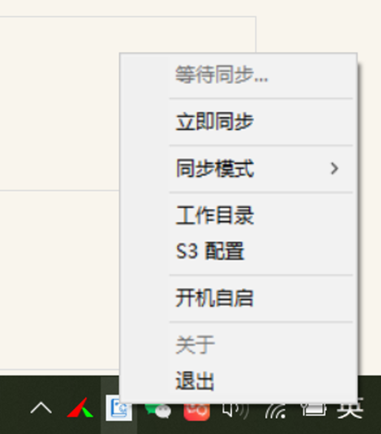
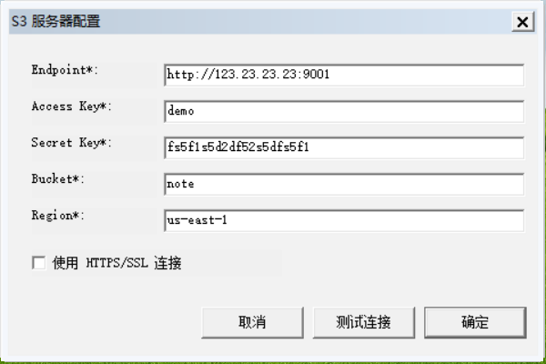
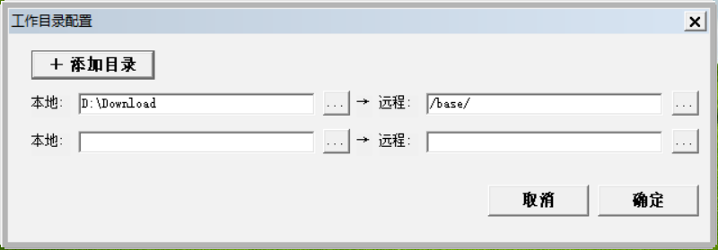

# sypora
如果你经常使用 Markdown 写作，那么你一定听说过大名鼎鼎的 `Typora`。Typora很适合本地写作，但是如果想实现多端同步，则需要借助其它同步工具来实现。本人尝试了很多工具都没有遇到心仪的，不是配置太烦琐就是工具太重，找一个轻量级的同步小工具太难了。于是借助AI自己开发了一个。

**sypora**，即是sync + typora 的组合。专门用于同步本地的笔记文件，实现多电脑笔记同步的工具。在自己的服务器上使用轻量级工具搭建一个支持S3协议的服务。在sypora中配置S3信息后，即可选中本地同步目录实现文档资源的同步。


## ✨ 特性

|      | 功能             | 说明                                                   |
| ---- | ---------------- | ------------------------------------------------------ |
| 👁️    | **简单好用**     | 没有多余的配置，简单好用。                             |
| 🖼️    | **图床支持**     | 兼容S3协议，图片也能顺便同步                           |
| 💾    | **本地优先**     | 数据存储在本地，无需登录，隐私安全                     |
| 📱    | **跨平台**       | macOS / Windows / Linux             |
| 🌙    | **界面风格**     | 亮色 / 深色 双模式可选                                 |


## 📚 使用方法

1.**在release页面下载 sypora.exe 点击应用后台运行。**




2.**配置同步S3服务器**




3.**配置同步目录**




#### 🧭 说明：

同步模式设有 **手动同步** 和 **自动同步 **。手动同步对于第一次或者想要快速同步的情况；自动同步则程序自动监听同步目录下的变动，自动地完成文档笔记同步。


## ⚙️ 开发构建

#### **🛠️ 项目所需:**

- [Go 1.21+](https://go.dev/dl/)
- Git (拉取代码)


#### 🚲 本地运行:

```bash
# 进入项目目录
go mod tidy
go run .
```


#### 👷 本地构建:

```bash
# 进入项目目录
scripts/build.bat

# 构建生成无控制台窗口的 sypora.exe
```

